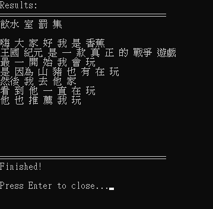

# 圖片文字辨識


## 安裝套件
- 安裝 tesseract
  - [下載](https://github.com/UB-Mannheim/tesseract/wiki)
  - [下載語言訓練資料](https://github.com/tesseract-ocr/tessdata_best)
- 安裝 python 套件
  ```
  py -m pip install pytesseract
  py -m pip install pillow
  ```